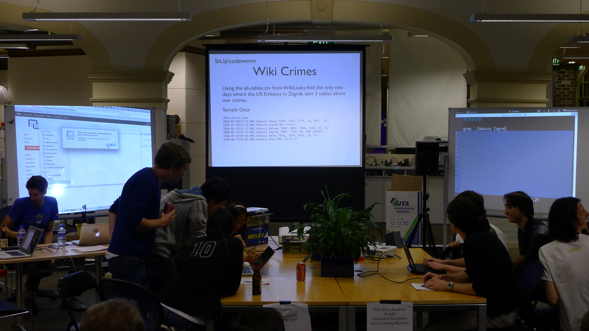
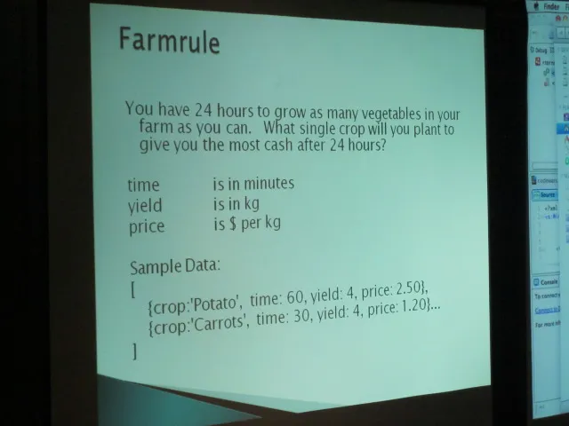
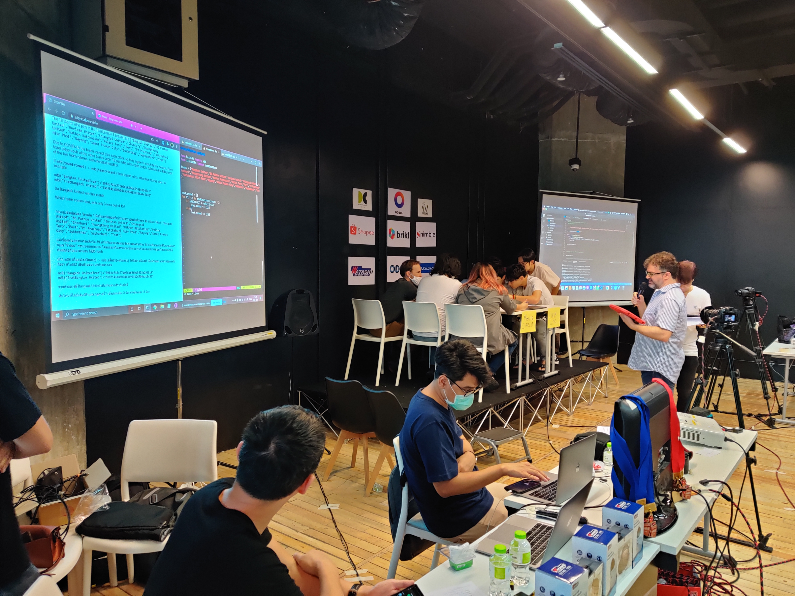
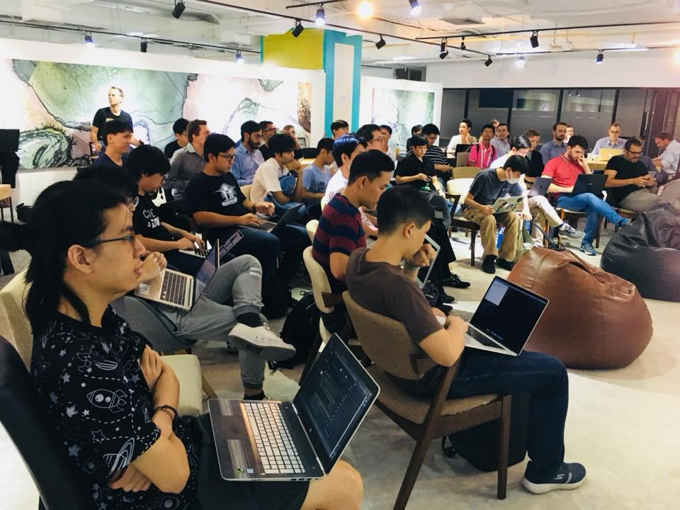
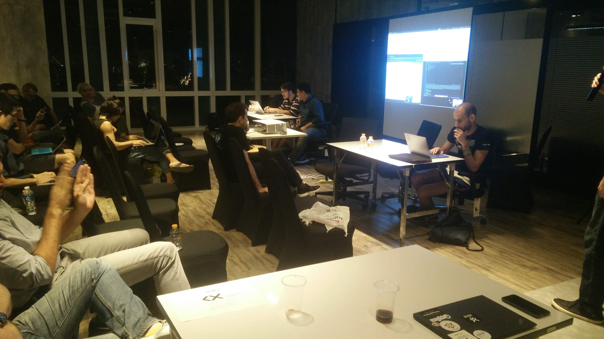
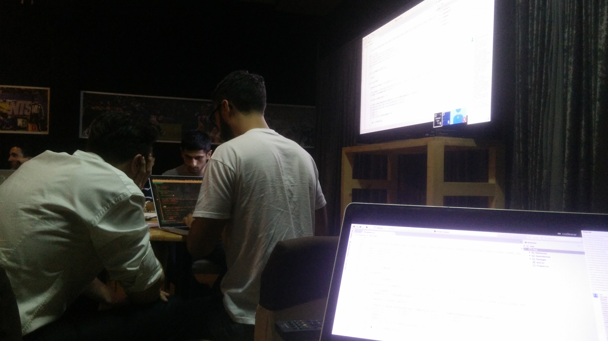
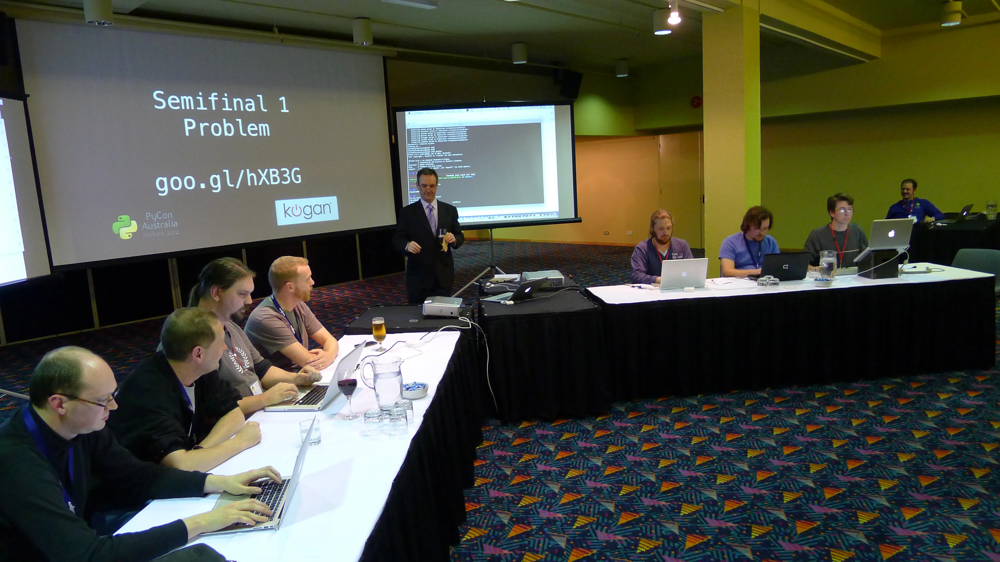
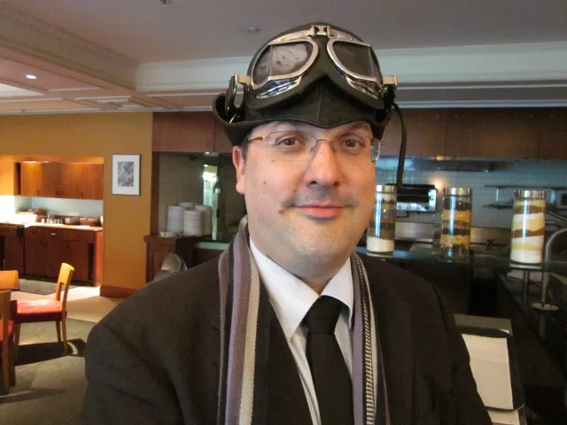
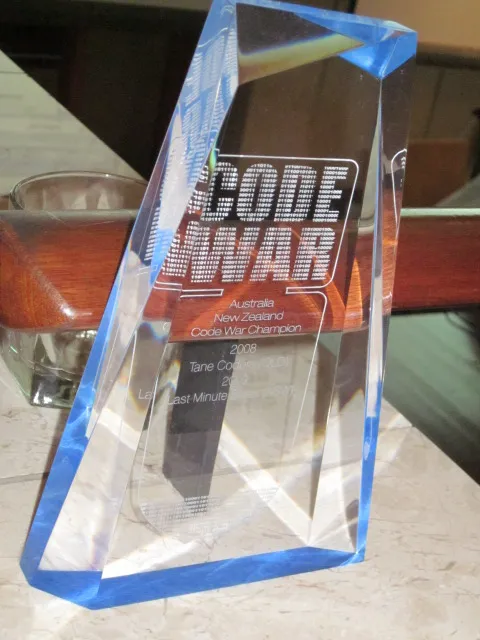

# CodeWar

[Facebook](https://www.facebook.com/codewarfederation)

Rules of a CodeWar
1. War means Fun!
   - winning doesn't make you a code ninja
   - winning won't improve your hackerrank (or https://www.codewars.com/... unrelated)
   - winning won't double your salery
   - these are silly problems, solved under distracting circumstances. Think fizzbuzz fight not project euler.
2. You can use **any language** you want
3. Qualification round everyone plays
   - A question will be put on the screen.
   - The first 6 individuals to submit the answer become team leaders and get to pick their team 2-4 others to be their team mates
4. Bring your laptop
   - You will think this is not for you
   - then you will see the problems and want to solve them
   - then you will regret not bringing your laptop
5. 1 Device per team
   - yes you will have to talk to your team mates
   - the single laptop will be projected on the big screen with a font large enough for everyone to see
6. First to answer wins
   - Instant knockout round betweeb 2 teams on stage
   - The answer has to be computed and said out loud as the answer
   - if no win inside 20min the codemaster can choose a winner, extend the time or declare a dance off at their discreation.
7. Team's 7 & 8 will be picked from smug teams
   - A "smug team" is anyone from the audience who finishes before the teams on stage
   - This gives you a second chance to compete
8. Last team stading wins.
   - Codewar is an 8 Team single elimination tournament

## What are the questions like?

## History

### 2020-12-19 Bangkok Codewar 2020

Thanks to effective covid measures 2020 was covid free enough for us to hold an in-person event (we were lucky. Days later it covid broke out). Held at AIS DC with a large attendance. 

<iframe src="https://www.facebook.com/plugins/video.php?height=314&href=https%3A%2F%2Fwww.facebook.com%2Fcodewarfederation%2Fvideos%2F1016001628885678%2F&show_text=false&width=560&t=0" width="560" height="314" style="border:none;overflow:hidden" scrolling="no" frameborder="0" allowfullscreen="true" allow="autoplay; clipboard-write; encrypted-media; picture-in-picture; web-share" allowFullScreen="true"></iframe>

[codewar.info](https://codewar.info)

### 2019-12-13 Bangkok Christmas CodeWar 2019

<video style="max-width:100%" controls>
  <source src="assets/images/2019_video.mp4" type="video/mp4">
  Your browser does not support the video tag.
</video>

Held at [Kaidee on Friday the 13th](https://www.ticketmelon.com/codewarfederation/christmascodewar2019?fbclid=IwAR2WsAOH7YhBL81jpcUOH84i8r1zYfn5vdimmoLJrjrZmM_g2P9JS9zk70Q) with 12 different dev meetups involved.
GummyBear recruitment sponsored the prizes of 5 RasberryPi 4s and Microsoft Azure sponsored beers and food.

### 2018-12-14 Code War Bangkok 2018!

Microsoft sponsored giving all the winning team a Surface Go. Hosted at "The Company" coworking space bangkok with over 100 attending.

[more pictures](https://www.facebook.com/codewarfederation/posts/120601169358416)

### 2018 PyCon Thailand

In 2018, Dylan Jay created a [CodeWar as a warm up event to the first PyCon Thailand](https://2019.th.pycon.org/pycon2018/code-war/index.html).

Memorable because last minute the quizzmaster had somehow lost the answers to the questions so instead the organisers were solving them barely ahead of the contestants. It also seems we relaxed the 3 person per team rule.

<iframe src="https://www.facebook.com/plugins/video.php?height=314&href=https%3A%2F%2Fwww.facebook.com%2FPyConThailand%2Fvideos%2F362179677639589%2F&show_text=false&width=560&t=0" width="560" height="314" style="border:none;overflow:hidden" scrolling="no" frameborder="0" allowfullscreen="true" allow="autoplay; clipboard-write; encrypted-media; picture-in-picture; web-share" allowFullScreen="true"></iframe>

### 2016-12-29 - Holiday Edition Social Hack Night on NYEEE

In 2014 Dylan Jay moved to Bangkok and started the first Python Meetup (ThaiPy), the BKK Hack Night and also introduced the
CodeWar concept at the [end of 2016 as a social event for the BKK Hack Night](https://www.meetup.com/en-AU/bkkhack/events/cxdkxlyvqbmc/).

Memorable by getting kicked out of the venue at midnight and having to run the final at the regular meetup the following month.

### 2012-2013 PyConAU (Hobart)

There is a [good write up of the events in Aug 2012](https://www.curiousvenn.com/2012/08/codewars-at-pycon-au-2012/?fbclid=IwAR0g1Dc2G6aO7UQTRaiND_WWXHfLNsQWQmNJcHx4sImnTiLmp8hGaWKVuNA)

Rules were the same except they dropped the one device per team rule. Not sure why.

In 2013 the PyCon Hobart organizers felt the need change the rules to make it a long cryptic adventure that everyone played from the audience which ended up removing all drama, pace and fun out of the event. PyConAu dropped codewars after this.

### 2010-2019 Kiwi PyCon

From 2010 Kiwi PyCon also included the code war as a warm up event and continued to do so every year. 
In [2014 they messed with the format](https://wellington.pm.org/articles/codewars2014/) so all teams did all questions and noone got to see anyone's code. They didn't do this again.

Links to other kiwi pycon codewar's [2011](https://www.scoop.co.nz/stories/BU1108/S00792/calling-all-it-geeks-and-tech-savvy-people.htm), [2019](https://python.nz/kiwipycon.x.codewars)

### 2010-2011 PyConAU (Sydney)

Dylan Jay and Andy Stewart fell in love with the CodeWar concept and when the first ever PyConAU happenin in sydney
2010 they proposed it as [a friday night warmup event](http://anyvite.com/byq1czpyyc) before the conference start on the saturday. It was hosted at Atlassian.

It was after this event the rule of the answer having to be both "said" and "on screen". The ambiguous result was resolved
peacefully via a danceoff

<iframe width="560" height="315" src="https://www.youtube.com/embed/gH4S6WfgWwk?si=K86oxkurULCvK8RY" title="YouTube video player" frameborder="0" allow="accelerometer; autoplay; clipboard-write; encrypted-media; gyroscope; picture-in-picture; web-share" allowfullscreen></iframe>

[Graeme Cross: 2011 Codewar](https://www.flickr.com/photos/66855660@N07/with/6087255630/) and [more](https://hiveminer.com/Tags/codewar)

### 2008-2011 WebDU Sydney

CodeWar was created by [Rocketboots CTO Robin Hilliard](https://www.linkedin.com/in/robinhilliard/) as a warm up social event for friday night before the [WebDU conference](https://www.flickr.com/photos/webdu/3553047315/) in Sydney from 2008. Originally based on an idea from the book [PeopleWare](https://en.wikipedia.org/wiki/Peopleware:_Productive_Projects_and_Teams). 

Original rules were the same except
- There was no qualification round. You just signed up
- Semi finals were [40min "creative" rounds judged on audience applause](https://www.eriontheinterweb.com/2010/05/codewars-2010-the-challenge-make-an-app-to-make-steve-jobs-relax-in-flash)... it was a flash/coldfusion conference after all.

