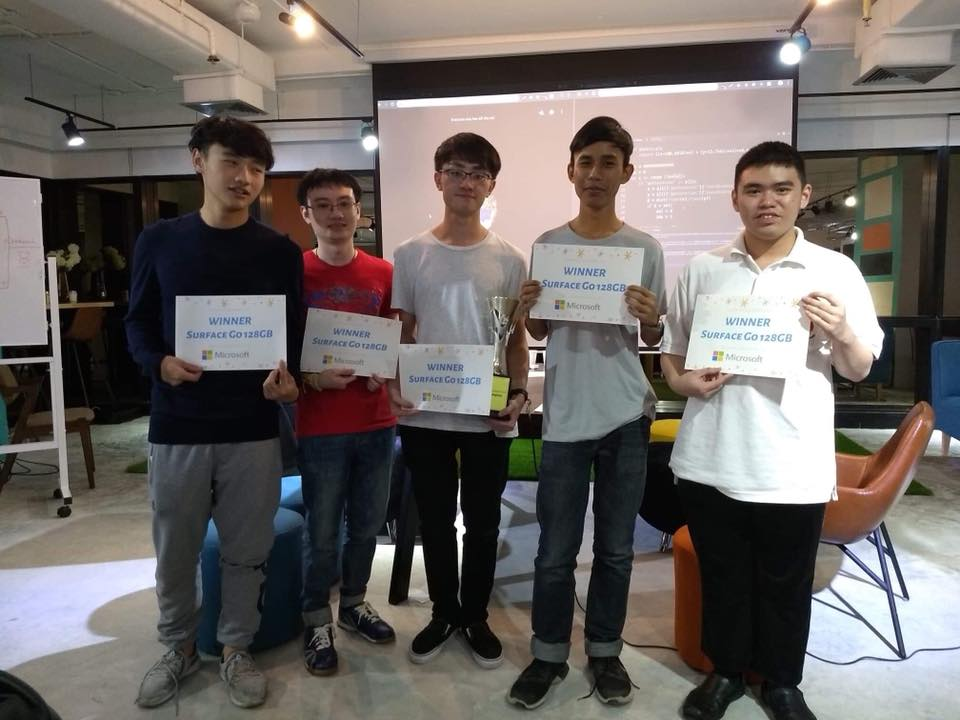

Live coding live tournament: Two laptops, two projectors, two teams at a time, one programming task - everyone else has some finger food and a drink and watches. Teams of 3-5 people formed spontaneously.

Rules of a CodeWar
1. Codewar is for fun
   - winning doesn't make you a code ninja
   - winning won't improve your hackerrank
   - winning won't double your salery
   - it is not https://www.codewars.com/
   - these are silly problems, solved under distracting circumstances. Think fizzbuzz fight not enigma code.
7. Codewar is an 8 Team single elimination tournament
3. Qualification round everyone plays
   - A question will be put on the screen.
   - The first 6 individuals to submit the answer become team leaders and get to pick their team.
4. You can use any language you want
2. Bring your laptop
   - You will think this is not for you
   - then you will see the problems and want to solve them
   - you will regret not bringing your laptop
5. Teams are 3-5 players with a single laptop
   - yes you will have to talk to each other
   - the single laptop will be projected on the big screen with a font large enough for everyone to see
6. Each match is 2 teams with first compute the correct answer and say it wins
   - if no team is finished in 20min the quizmaster maybe choose a winner, extend or declare a dance off
7. Team's 7 & 8 will be picked from smug teams
   - A smug team is anyone from the audience who finishes before the teams on stage
   - Gives you a second chance to compete
   

# What are the questions like?

# Which crazy person thought up this idea and how did it get to Bangkok?

## 2020-12-19 Bangkok Codewar 2020

Thanks to effective covid measures 2020 was covid free enough for us to hold an in-person event (we were lucky. Days later it covid broke out). Held at AIS DC with a large attendance. 

## 2019-12-13 Bangkok Christmas CodeWar 2019

Held at [Kaidee on Friday the 13th](https://www.ticketmelon.com/codewarfederation/christmascodewar2019?fbclid=IwAR2WsAOH7YhBL81jpcUOH84i8r1zYfn5vdimmoLJrjrZmM_g2P9JS9zk70Q) with 12 different dev meetups involved.
GummyBear recruitment sponsored the prizes of 5 RasberryPi 4s and Microsoft Azure sponsored beers and food.

## 2018-12-14 Code War Bangkok 2018!

Microsoft sponsored giving all the winning team a Surface Go. Hosted at "The Company" coworking space bangkok with over 100 attending.

https://www.facebook.com/codewarfederation/posts/120601169358416

## 2018 PyCon Thailand Warm up event

In 2018, Dylan Jay created a CodeWar as a warm up event to the first PyCon Thailand.

## 2016-12-29 - Holiday Edition Social Hack Night on NYEEE

In 2014 Dylan Jay moved to Bangkok and started the first Python Meetup (ThaiPy), the BKK Hack Night and also introduced the
CodeWar concept at the [end of 2016 as a social event for the BKK Hack Night](https://www.meetup.com/en-AU/bkkhack/events/cxdkxlyvqbmc/).

## 2012-2013 PyConAU (Hobart)

There is a [good write up of the events in Aug 2012](https://www.curiousvenn.com/2012/08/codewars-at-pycon-au-2012/?fbclid=IwAR0g1Dc2G6aO7UQTRaiND_WWXHfLNsQWQmNJcHx4sImnTiLmp8hGaWKVuNA)

Rules were the same except they dropped the one device per team rule. Not sure why.

In 2013 the PyCon Hobart organizers felt the need change the rules to make it a long cryptic adventure that everyone played from the audience which ended up removing all drama, pace and fun out of the event. PyConAu dropped codewars after this.

## 2010-2014? Kiwi PyCon warm up party

From 2010 Kiwi PyCon also included the code war as a warm up event and continues to do so every year. In 2014 the did experiment with a different format - https://wellington.pm.org/articles/codewars2014/

## 2010-2011 PyConAU warn up party (Sydney)

Dylan Jay and Andy Stewart fell in love with the CodeWar concept and when the first ever PyConAU happenin in sydney
2010 they proposed it as [a friday night warmup event](http://anyvite.com/byq1czpyyc) before the conference start on the saturday. It was hosted at Atlassian.

  - https://www.flickr.com/photos/66855660@N07/with/6087255630/ 

It was after this event the rule of the answer having to be both "said" and "on screen". The ambiguous result was resolved
peacefully via a danceoff

- https://hiveminer.com/Tags/codewar. 

## 2008-2011?? WebDU warm up party

Conceived as a warm up social event for friday night before the WebDU conference in Sydney from 2008 by Rocketboots CTO Robin Hilliard - https://www.flickr.com/photos/webdu/3553047315/. Originally based on an idea from the book PeopleWare. 

Original rules were the same except
- There was no qualification round. You just signed up
- Semi finals were [40min "creative" rounds judged on audience applause](https://www.eriontheinterweb.com/2010/05/codewars-2010-the-challenge-make-an-app-to-make-steve-jobs-relax-in-flash)... it was a flash/coldfusion conference after all.

